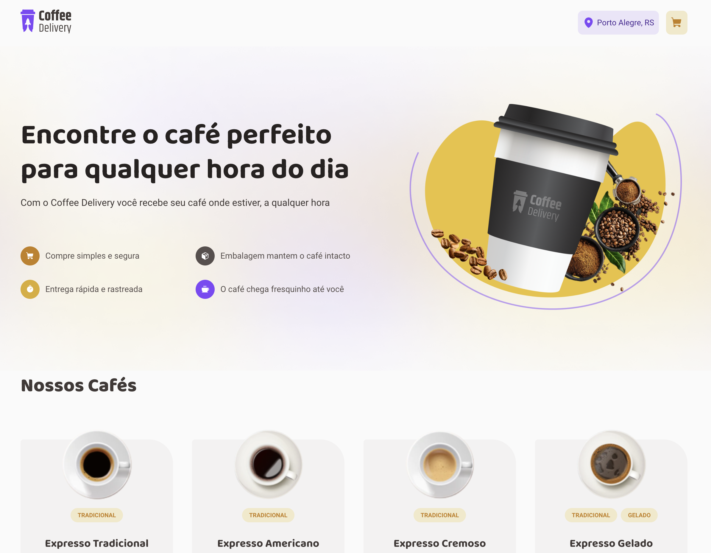
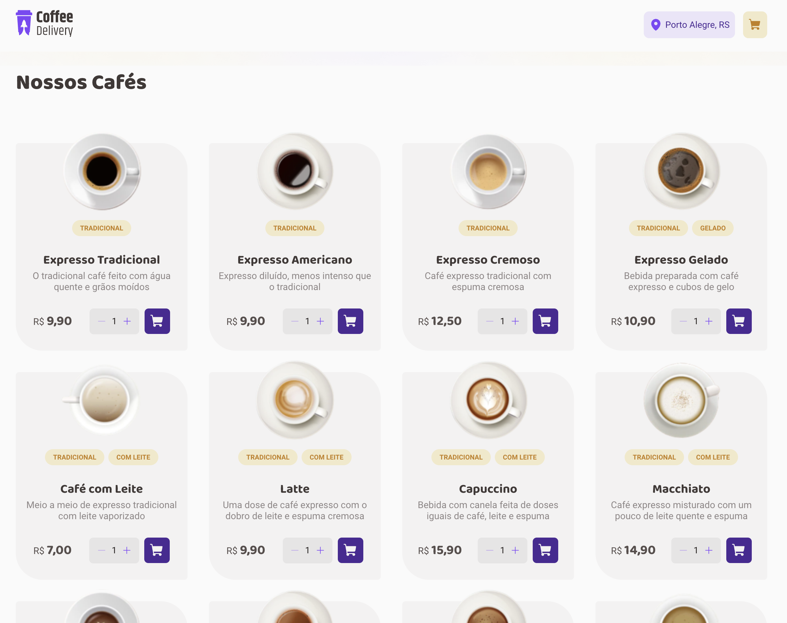
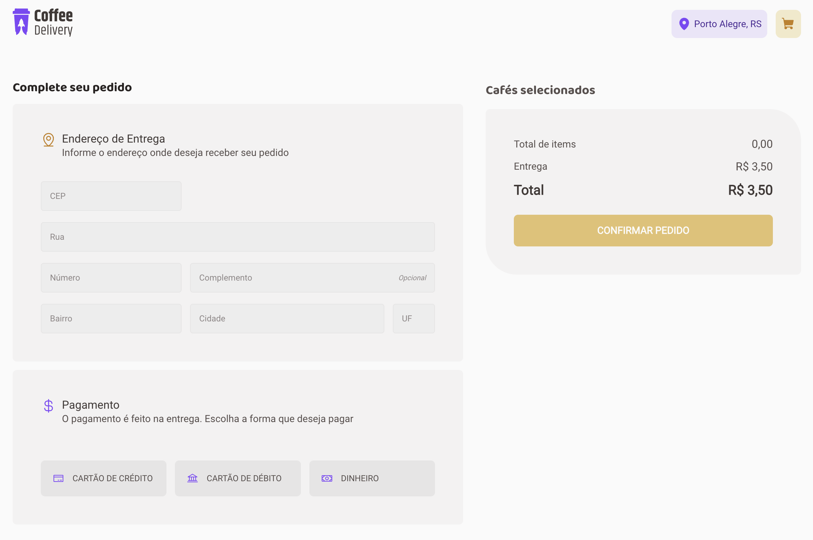
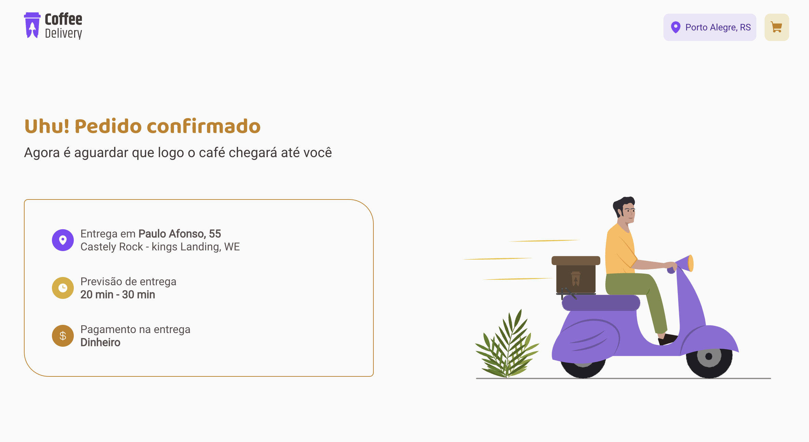

## Ignite Todo List

<h3>Página inicial</h3>

<h3>Lista de Cafés</h3>

<h3>Formulário de Entrega e cálculo do valor total</h3>

<h3>Validação do Formulário</h3>

<h3>Página de Pedido Completo</h3>

 

### Tecnologias usadas

O projeto foi desenvolvido usando [React.js](https://react.dev/) e [Vite](https://vitejs.dev/)
junto com [Styled-Components](https://styled-components.com/) para estilizar a aplicação.
Na parte dos formulários foi usado o [React-Hook-Form](https://react-hook-form.com/) e o [Zod](https://zod.dev/) para validação dos schemas.

### License

© Feito com muito &#10084; por Hugo Ramon Pereira -> [Portfolio](https://hugoramonpereira.dev/) -> [LinkedIn](https://www.linkedin.com/in/hugo-ramon-pereira/) 🇧🇷 durante o desafio do curso da [Rocketseat](https://www.rocketseat.com.br/)
